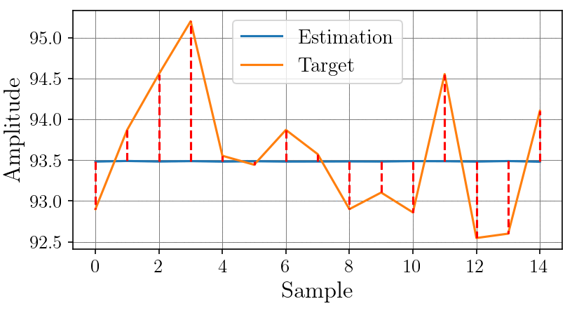
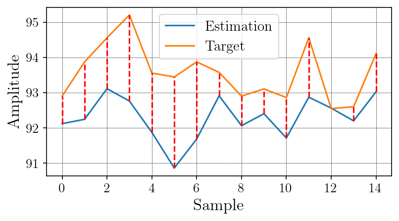

# Complex-Valued Autoencoder for Frequency Data

This repository provides additional evaluation results for our study on complex-valued autoencoders. We compare the learned representations from the complex-valued model against a classical real-valued autoencoder on a downstream regression task: **hardness estimation**.

---

## 📊 Downstream Task Setup

* **Feature Encoders**: Pretrained from

  * Complex-valued autoencoder
  * Classical autoencoder (baseline)
  * 
* **Regressor**: Feedforward network with ReLU activations

  * Architecture: `640 → 256 → 64 → 16 → 4 → 1`
  * 
* **Regularization**:

  * Weight decay: `1e-4`
  * Input noise: Gaussian noise with std = `1%` of input std

---

## 🔍 Results

The training dynamics of the regressors are visualized as an animation (left: complex-valued autoencoder; right: classic autoencoder):

<p align="center">
  
  
</p>

---

## 📂 Repository Structure

```
├── assets/
│   └── train_dynamics.gif  # Training visualization
├── models/                 # Pretrained encoders & downstream models
├── src/                    # Scripts for training & evaluation
│   ├── complex_autoencoder.py
└── README.md
```

---


## 📌 Conclusion

These additional experiments demonstrate that the **complex-valued autoencoder** learns **richer frequency-domain representations**, enabling improved performance on downstream regression tasks even with limited annotated data.

---

## 📌 Requirements

* Python 3.8+
* PyTorch >= 1.10

---

## 📜 License

This project is licensed under the **MIT License**. See the `LICENSE` file for details.

---

## 🙋‍♂️ Author

**Diyar Altinses, M.Sc.**

---

## 📌 Citation
If you use this code or build upon our work, please cite our paper:


```bibtex
@inproceedings{altinses2025XXX,
  title={XXXX},
  author={Altinses, Diyar and Schwung, Andreas},
  booktitle={XXXX},
  pages={XXX},
  year={2025},
  organization={XXX}
}
```

---

